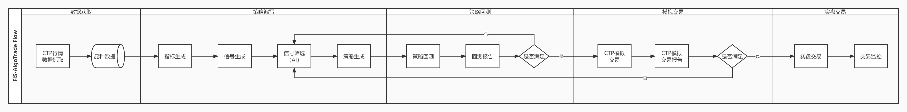
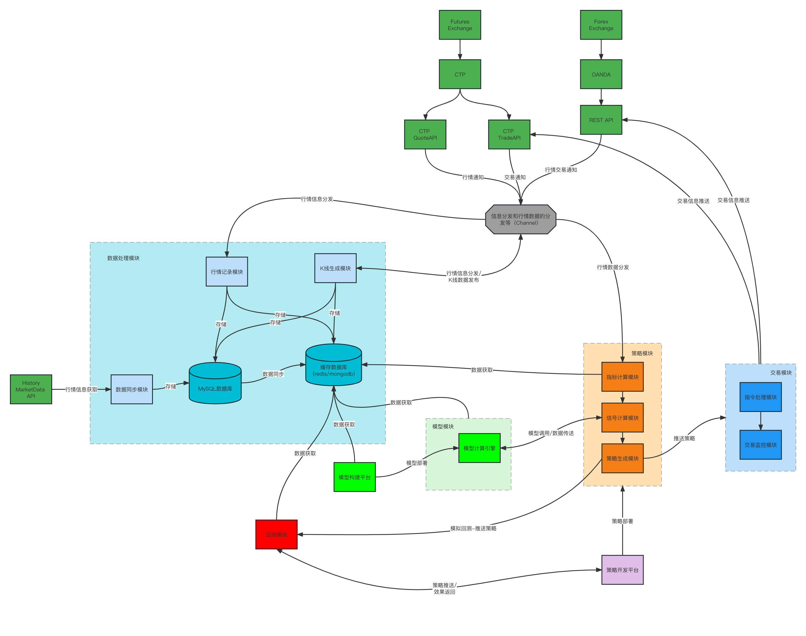

# FIS-AlgoTrade


## 说明

​	__本系统旨在使用机器学习算法驱动交易。__

### 交易流程



### 交易系统功能



## 文件夹结构


__csource__：C/C++源文件，封装CTPAPI等

__data__：数据存放目录

__doc__：文档存放目录

__gosource__：AlgoTrade主程序

__img__：图片路径

__libs__：本系统生成的动态（静态）链接库文件存放目录

__macos__：macOS项目文件

__pysource__：Python信号和策略计算程序模块

__server__：模块部署程序

__test__：模块测试程序

__windows__：VS Solution文件目录

__wrapctp_gen__：CTP文件生成器


## CTP API接口封装说明

### SFIT接口下载

1. 从[http://www.sfit.com.cn/5_2_DocumentDown_2.htm](http://www.sfit.com.cn/5_2_DocumentDown_2.htm)下载对应的行情和交易API文件
2. 将下载的不同系统的接口文件，按照项目根目录下的`csource/ctpapi`的`linux`、`macos`、`windows`文件夹里的命名格式进行命名，并存放到对应文件夹。

### 生成CTP API接口包装文件
1. 进入项目根目录下的`wrapctp_gen`文件夹
2. 运行不同的命令生成封装代码，命令如下：
   1. 对于C代码
    ```
    go run wrapper_gen.go -csys macos -lang c -outpath ../csource/src/wrapper_ctp/macos

    go run wrapper_gen.go -csys windows -lang c -outpath ../csource/src/wrapper_ctp/windows

    go run wrapper_gen.go -csys linux -lang c -outpath ../csource/src/wrapper_ctp/linux
    ```
   2. 对于Python代码
    ```
    go run wrapper_gen.go -csys macos -lang python -outpath ../pysource/CtpApi/macos

    go run wrapper_gen.go -csys windows -lang python -outpath ../pysource/CtpApi/windows

    go run wrapper_gen.go -csys linux -lang python -outpath ../pysource/CtpApi/linux
    ```
   3. 对于Golang代码
    ```
    go run wrapper_gen.go -csys macos -lang golang -outpath ../gosource/ctpapi/

    go run wrapper_gen.go -csys windows -lang golang -outpath ../gosource/ctpapi/

    go run wrapper_gen.go -csys linux -lang golang -outpath ../gosource/ctpapi/
    ```
### 生成CTP API的C版动态链接库

#### Macos平台生成方式

1. 打开项目根目录下的`macos`文件夹下的`AlgoTrade`工作空间，对其中项目进行编译。
__如果使用Xcode进行编译，需要在Xcode的 Build Settings -> Apple Clang - Code Generation -> Symbols Hidden by Default设置为`No`，或者在需要导出的函数前添加 `__attribute__((visibility("default")))`__
2. 将生成动态链接库文件，默认在项目根目录`macos/DerivedData/Build/Products/Release`下面的`.dylib`文件和_SFIT接口下载_第2步里面的`.a`文件拷贝到项目根目录`libs/ctpapi`下。
3. 同时，将生成动态链接库文件，默认在项目根目录`macos/DerivedData/Build/Products/Release`下面的`.dylib`文件拷贝到`/usr/local/lib/`（进入动态链接库生成路径，运行`cp libctp*.dylib /usr/local/lib/`）。也可以将该路径添加到系统环境变量。

#### Windows平台生成方式

1. 打开项目根目录下的`windows`文件夹下的`AlgoTrade`解决方案，对其中项目进行编译
2. 将生成动态链接库文件，默认在项目根目录`windows\x64\Release`下面的`.dll`文件和 _SFIT接口下载_ 第2步里面的`.dll`文件拷贝到项目根目录`libs/ctpapi`下。
3. 为了方便全局使用，将该路径添加到系统环境变量。（添加完成后，需要重启terminal/cmd）。


#### Linux平台生成方式

1. 进入项目根目录下的`csource/src/wrapper_ctp/linux`文件夹，运行一下命令分别编译Quote和Trade的C API：

    ```
    g++ -shared -fPIC -Wl,-rpath . -L ../../../ctpapi/linux/ -o ../../../../libs/ctpapi/libctpquote_api.so ctpquote_api.cpp -lthostmduserapi_se -lthosttraderapi_se -lLinuxDataCollect

    g++ -shared -fPIC -Wl,-rpath . -L ../../../ctpapi/linux/ -o ../../../../libs/ctpapi/libctptrade_api.so ctptrade_api.cpp -lthostmduserapi_se -lthosttraderapi_se -lLinuxDataCollect
    ```
2. 将动态链接库所在路径`<yourpath>/libs/ctpapi`添加到系统路径里面，命令语句：`export LD_LIBRARY_PATH=$LD_LIBRARY_PATH:<yourpath>/libs/ctpapi` （添加完成后需要`source conffile`，立即生效）
``
3. 设置Linux信息采集库权限`chmod u+s libLinuxDataCollect.so`

### 测试动态链接库

CTP Api测试代码在项目根目录下的`test/test_ctpapi`下：`python`测试代码为`test_quote.py`和`test_trade.py`；`golang`测试代码为`test_ctpapi.go`。


## 附
_Note: 对于C/C++编译方式，建议统一编写CMakeLists生成MakeFile，进行编译，对于Windows系统可额外创建VS Solution，对于MacOS系统可额外创建Xcode Project。_


